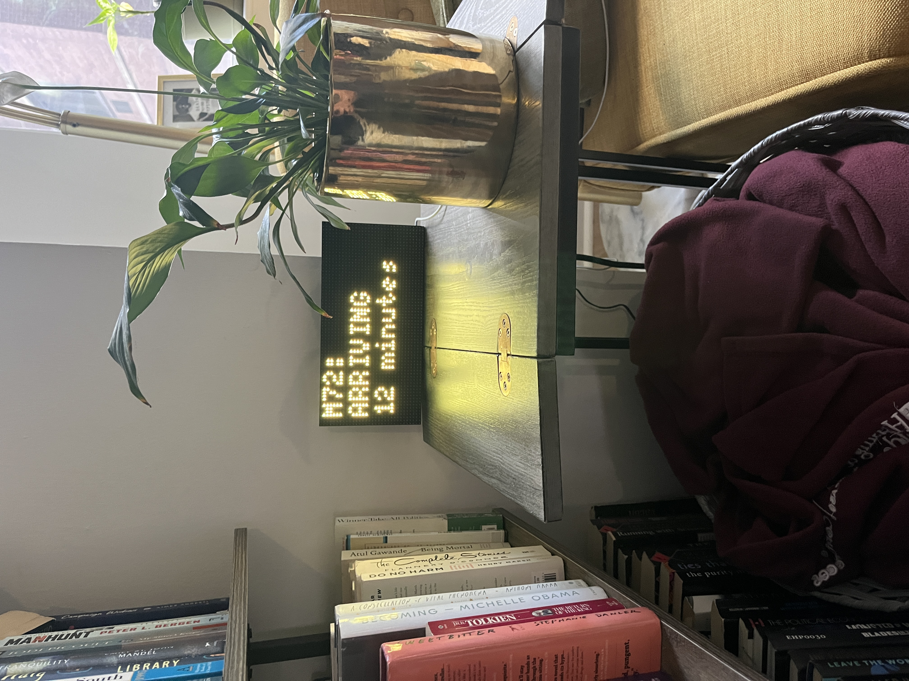
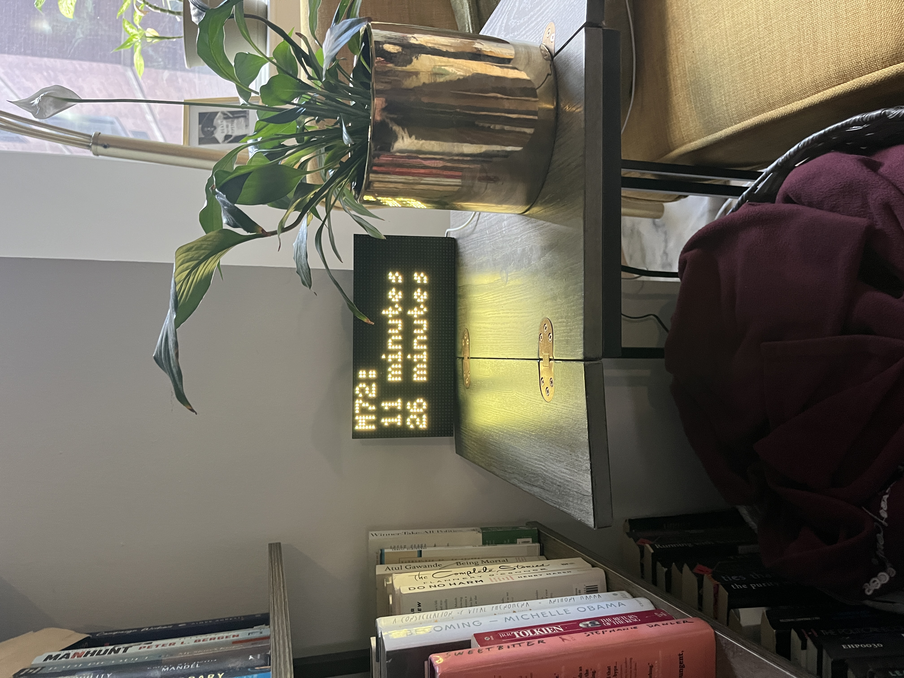
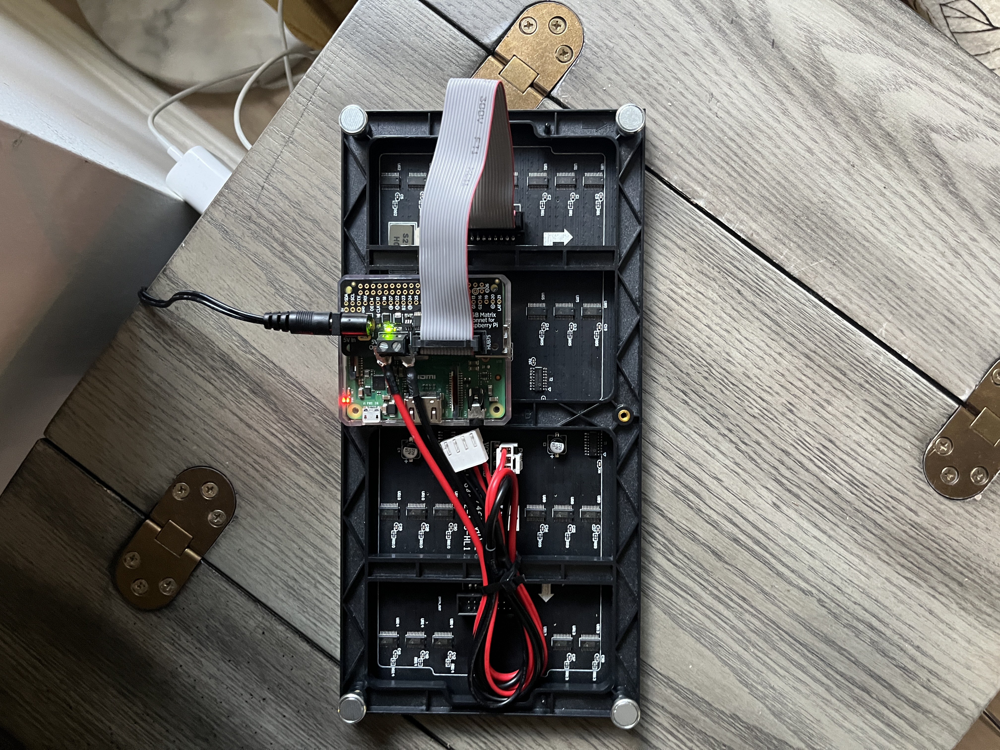

# buspi




## Basic Overview

buspi is a Python application that runs on a Raspberry Pi single-board computer. It provides updates for a specified MTA bus stop in New York City. The app queries the MTA Bus API and outputs to an LED Matrix, letting you when the next buses are coming.

## Overview

I was seeing ads on social media for LED displays that can scroll news, sports score, public transit info, and other personalized items. I decided it would be cool to have one in my apartment letting me know when a bus is approaching the stop on my block. This application is enabled by the [rpi-rgb-led-matrix library](https://github.com/hzeller/rpi-rgb-led-matrix), which is aproject that allows you to control an LED matrix with a Raspberry Pi. There are many great examples on github of people using the library to control their own displays. I referenced klinstifen's [guerillaClock repo](https://github.com/klinstifen/guerillaClock) specifically when exploring the library and learning how to write my own application.

## Materials

Other Raspberry Pis can work, I used a 3 A+.

- [Raspberry Pi 3 A+](https://www.raspberrypi.com/products/raspberry-pi-3-model-a-plus/)

Bonnet is unnecessary if you wire the LED matrix directly to your Pi.

- [Adafruit RGB Matrix Bonnet for Raspberry Pi](https://www.adafruit.com/product/3211)

The application output to an LED matrix, here is the one I used. Other matrices in other dimensions could work, but you will need to tweak the code to adjust the ouput settings.

- [64x32 RGB LED Matrix - 4mm pitch](https://www.adafruit.com/product/2278)

The matrix pulls more power than just the Pi on its own, so you will need a larger powersupply depending on the size of your matrix. This is the one I used, read up on what your Pi needs and what your matrix needs in addition.

- [5V 4A Power Supply](https://www.amazon.com/gp/product/B09JW28WQC/ref=ppx_yo_dt_b_asin_title_o00_s00?ie=UTF8&th=1)

An SD card to load the Raspberry Pi OS onto your Raspberry Pi. The application takes up very little space, so 32gb is overkill, but you might as well pick up something that can be used for future projects.

- [SD Card](https://www.amazon.com/dp/B08GYG6T12/ref=twister_B0BN8Q1Z9S?_encoding=UTF8&th=1)

## Setup

Follow these steps to setup this project on your own Raspberry Pi and LED matrix.

### Raspberry Pi OS Install

Perform a clean installation of Raspberry Pi OS Lite on your SD card. I used the official imager software, but they also have options to manually download the image. The Lite version is recommended by the creator of the rpi-rgb-led-matrix module, see the link below to their notes in the README. I initially tried a regular installation of Raspberry Pi OS, and was not able to get the project working.

- [Official Raspberry Pi Imager](https://www.raspberrypi.com/software/)
- [Remote Access Guide](https://www.raspberrypi.com/documentation/computers/remote-access.html#ssh)
- [Lite Version Notes](https://github.com/hzeller/rpi-rgb-led-matrix/tree/master?tab=readme-ov-file#use-minimal-raspbian-distribution)

### Connect Pi to Matrix

The rpi-pgb-led-matrix library README has a summary of the various ways you can wire your pi to the matrix. I opted to order and use an adafruit bonnet to avoid having to manually wire or solder anything. Link to what I used is below.

- [Adafruit RGB Matrix Bonnet](https://www.adafruit.com/product/3211) 
- [Matrix Setup](https://github.com/hzeller/rpi-rgb-led-matrix?tab=readme-ov-file#lets-do-it)

### First Time Setup

Run all of the following commands. The first two check for and install any updates to the pi. The third installs git on the pi so we can download the application. The final command downloads the repository from github, along with the submodule.

```txt
sudo apt update
sudo apt upgrade
sudo apt install git
git clone --recursive https://github.com/jbalooshie/trainpi.git
```

### Install rpi-rgb-led-matrix library

Change into the trainpi folder using `cd trainpi` and install the rpi-rgb-led-matrix library using. Instructions for doing so are found in the project's [README](https://github.com/hzeller/rpi-rgb-led-matrix/tree/master/bindings/python#python-3). Follow steps to setup Python 3 bindings, it is as simple as copying, pasting, and running the code provided into the command line.

### Create config file

The application will read user provided details from a config file. This file will hold our api key and stop id. Follow the above instructions for obtaining these if you have not already. Execute the following code in the `trainpi` folder to create a new config.ini file: `sudo nano config.ini`. Then paste in the following text, modified with your own api_key and stop_id values. Be sure to save the file as `config.ini`.

```txt
[UserSettings]
api_key = 1234
stop_id = 5678
```

### Disable on-board sound

This improves performance of the application. See instructions provided by the rpi-rgb-led-matrix author for how to do so.

- [Disable on-board sound](https://github.com/hzeller/rpi-rgb-led-matrix/tree/master?tab=readme-ov-file#use-minimal-raspbian-distribution)

### Install pip and requests

This application uses the `Requests` Python library, which must be installed seperately. You should have installed Python when you installed the rpi-rgb-led-matrix library. Execute the following code. The first command adds the pip module, so we can pip install things. The second install `Requests`.

```python
sudo apt intall python3-pip
pip install requests
```

### Test app

Test the app to ensure it is working correctly. From the train pi folder, run the following command: `sudo app.py`. The app will log a few setup messages to the console and start printing bus times on your LED matrix.

### Add to boot

Finally, we will set up the app to run when the Pi is booted up, eliminating the need to manually run the program. Enter `sudo nano /etc/rc.local` and create a line above `exit 0` that reads `cd /home/pi/trainpi/ && sudo python app.py`. Then save and restart your Pi.

## Final Setup

To display the finished project, I simply sit the screen up on a table in the living room. I'd like to make a small frame for it to sit in out of wood or plastic, but I do not have the time to do so right now. I sat the Raspberry Pi board in a case I bought online, then fastened the case to the back of the matrix using double sided adhesive. I can't use the top half of the case to the bonnet, but it sits neatly on the back. I fasten the excess wires off to the side with a zip tie.



## Future Improvements

Here are some items I would add/fix in a potential future iteration:

- Add after hours message/timer for when the bus route is not running. Dim display during these times
- Fix how time is calculated if the next bus is coming after midnight, but before after hours starts. Currently it calculcates it as negative time, and returns `Delay`.
- Add notice to display if there is a delay or situation reported on the API.
